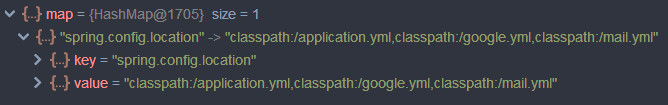
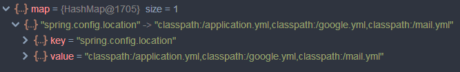

### Spring Boot에서 여러개의 Property, Yml을 추가하는 방법

**Spring boot 프로젝트**에서 여러개의 **property** 혹은 **yml**을 추가하며 겪은 문제와 해결방법을 공유해 보겠습니다.

프로젝트에 **OAuth**와 **MailSender**를 사용하기 위해 yml를 작성하던 중 Github에 올라가선 안될 `ClientId`나 `Password`를 숨기기 위해 yml을 분리하는 방법을 사용했습니다.

공개해도 괜찮은 설정은 `application.yml`에 작성하고 숨겨야 할 부분은 `google.yml`, `mail.yml`에 작성한 뒤 `.gitignore`에 추가했습니다.

이렇게 분리한 yml 파일은 다른 블로그들을 참고해 `SpringApplicationBuilder`의 `properties()` 메소드를 통해 등록해 주었습니다.

```java
String APPLICATION = "spring.config.location=classpath:/application.yml";
String GOOGLE = "spring.config.location=classpath:/google.yml";
String MAIL = "spring.config.location=classpath:/mail.yml";

public static void main(String[] args) {
    new SpringApplicationBuilder(RecruitJogbo.class)
                    .properties(APPLICATION, GOOGLE, MAIL)
                    .run(args);
}
```

분명히 블로그에 있는 코드를 따라 작성했지만 yml이 정상적으로 적용되지 않아 **MailSender** 빈을 등록할 수 없거나 **OAuth**에서 **Http url must not be null** 에러가 발생했습니다.

무엇이 문제인지 확인하기 위해 `properties()` 메소드를 살펴보니

```java
public SpringApplicationBuilder properties(String... defaultProperties) {
    return properties(getMapFromKeyValuePairs(defaultProperties));
}

private Map<String, Object> getMapFromKeyValuePairs(String[] properties) {
    Map<String, Object> map = new HashMap<>();
    for (String property : properties) {
        int index = lowestIndexOf(property, ":", "=");
        String key = (index > 0) ? property.substring(0, index) : property;
        String value = (index > 0) ? property.substring(index + 1) : "";
        map.put(key, value);
    }
    return map;
}
```

**HashMap**을 통해 입력한 yml을 추가하고 있었습니다. 이 때 application, mail, google 3개의 property 모두 `'spring.config.location'` 라는 같은 키 값을 가져 가장 마지막에 `put()`이 실행된 mail.yml 만 적용된 것을 볼 수 있습니다.


디버깅을 통해 확인한 `getMapFromKeyValuePairs()`의 반환값

키 값 `'spring.config.location'`에 3개의 yml 파일을 모두 추가하기 위해 `properties()` 의 **argument**를 다음과 같이 `'spring.config.location='` 뒤에 `','`로 추가해줍니다.

```java
private static final String PROPERTIES =
        "spring.config.location="
        +"classpath:/application.yml"
        +",classpath:/google.yml"
        +",classpath:/mail.yml";

public static void main(String[] args) {
    new SpringApplicationBuilder(RecruitJogbo.class)
            .properties(PROPERTIES)
            .run(args);
}
```

똑같이 실행 후 `getMapFromKeyValuePairs()`의 반환값을 확인해 보면 3개의 yml 파일이 추가된 것을 볼 수 있고 코드도 정상 동작하는 것을 확인할 수 있습니다.



이렇게 저장된 **property**가 어떻게 사용되는지까지는 확인하지 못했지만 여러개의 property를 추가하는 방법에 대해 알 수 있었습니다.