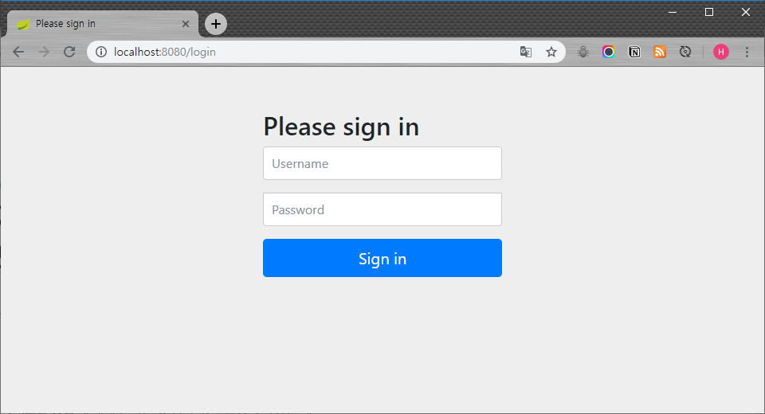
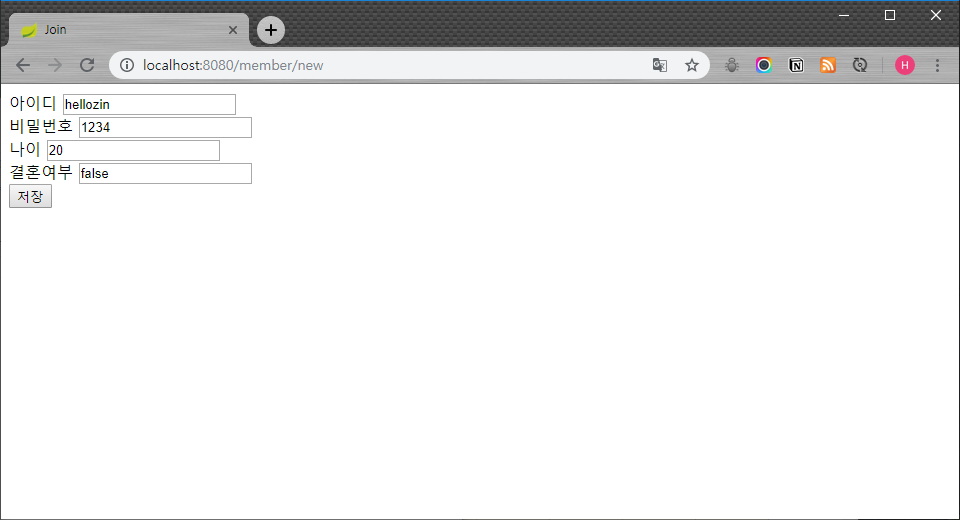
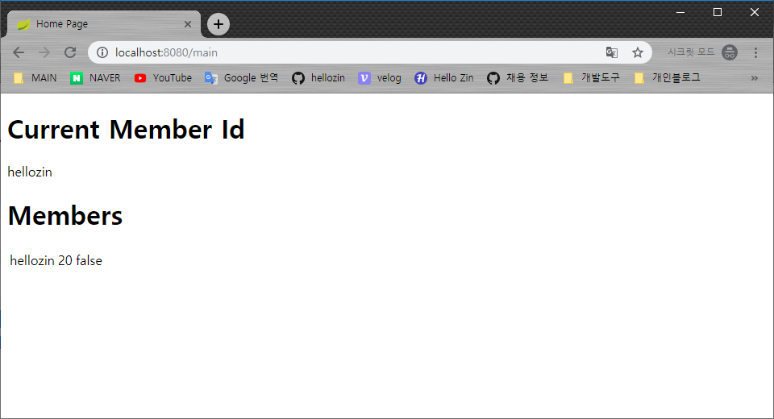
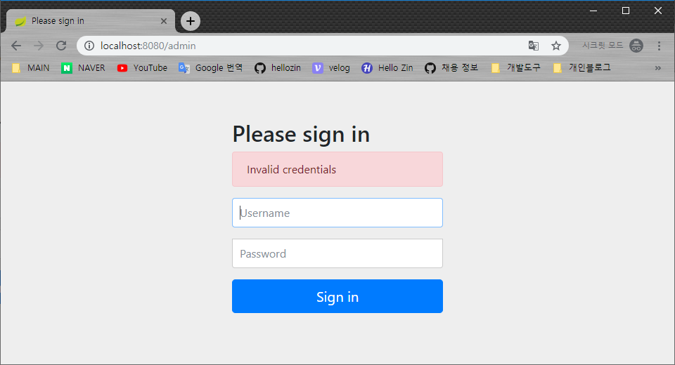
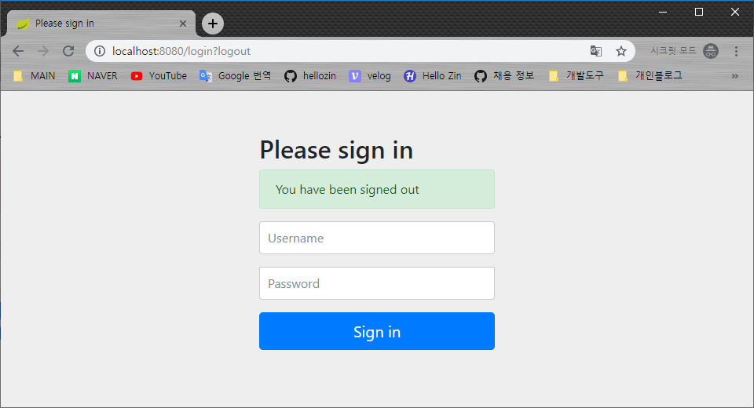

Spring Boot에서 Spring Security를 사용해 Form Login을 최대한 간단히 구현해 보겠습니다.

## 의존성

Spring Security를 위해 starter-security 의존성을 추가하고 편리한 테스트를 위해 web, jpa, thymeleaf, lombok, h2 의존성을 추가했습니다.

```java
    implementation 'org.springframework.boot:spring-boot-starter-web'
    implementation 'org.springframework.boot:spring-boot-starter-security'
    implementation 'org.springframework.boot:spring-boot-starter-data-jpa'
    implementation 'org.springframework.boot:spring-boot-starter-thymeleaf'
    compileOnly 'org.projectlombok:lombok'
    annotationProcessor 'org.projectlombok:lombok'
    runtimeOnly 'com.h2database:h2'
```

## 유저 정보

유저 정보를 위한 Entity를 생성합니다. Entity의 이름은 Spring Security 내부에서 사용하는 User 객체와 구분하기 편하도록 Member를 사용했습니다.


```java
@Entity
@NoArgsConstructor(access = AccessLevel.PROTECTED)
@Getter
@ToString
public class Member {

    @Id @GeneratedValue
    private Long id;

    private String memberId;

    private String password;

    private Integer age;

    private Boolean isMarried;

    public Member(String memberId, String password, Integer age, Boolean isMarried) {
        this.memberId = memberId;
        this.password = password;
        this.age = age;
        this.isMarried = isMarried;
    }

    public void setPassword(String password) {
        this.password = password;
    }

}
```

Lombok을 통해 protected 기본 생성자, Getter, ToString을 생성했습니다. 

> Entity에 public 혹은 protected 기본 생성자가 있어야 하는 이유는 JPA의 proxy패턴과 reflection에 대해 더 공부한 뒤 포스팅 해 보겠습니다.

password를 암호화 하기 위해 setter를 따로 추가했습니다. 원래는 DTO를 따로 작성해 처리하는 것이 좋겠지만 편의를 위해 기존 Entity에 추가했습니다.

## Role

이름에서 알 수 있듯 유저 정보에 부여할 수 있는 '권한'입니다. 여기에서는 MEMBER와 ADMIN 두 가지 권한을 Enum으로 정의하겠습니다. Role value의 앞에는 `"ROLE_"` 문자열이 있어야 합니다.

```java
@AllArgsConstructor
@Getter
public enum Role {

    MEMBER("ROLE_MEMBER"),
    ADMIN("ROLE_ADMIN");

    private String value;

}
```

## Repository 와 Controller

Repository에 뒤에 나올 `UserDetailsService`에서 사용하기 위한 `findByMemberId()` 메소드를 추가합니다. 

```java
public interface MemberRepository extends JpaRepository<Member, Long> {

    Optional<Member> findByMemberId(String memberId);

}
```

기본적으로 보여줄 페이지와 ADMIN 권한을 가진 유저만 접근 가능한 페이지, 새로운 멤버의 가입 요청을 처리하는 Controller를 작성합니다.

```java
@Controller
@RequiredArgsConstructor
public class MemberController {

    private final MemberRepository memberRepository;

    private final PasswordEncoder passwordEncoder;

    @GetMapping("/main")
    public String mainPage(Map<String, Object> model) {
        List<Member> members = memberRepository.findAll();
        model.put("members", members);
        return "homepage";
    }

    @GetMapping("/admin")
    public String adminPage(Map<String, Object> model) {
        return "adminpage";
    }

    @GetMapping("/member/new")
    public String memberJoinForm(Member memberForm) {
        return "memberJoinForm";
    }

    @PostMapping("/member/new")
    public String memberJoin(Member memberForm) {
        memberForm.setPassword(passwordEncoder.encode(memberForm.getPassword()));
        memberRepository.save(memberForm);
        return "redirect:/main";
    }

}

```

요청에 따라 보여줄 html 파일도 간단히 작성합니다. 기본 페이지의 경우 현재 DB에 저장된 유저 목록을 보여줍니다.

**homepage.html**

```html
<!DOCTYPE html>
<html lang="en" xmlns:th="http://www.thymeleaf.org">
<head>
    <meta charset="UTF-8">
    <title>Home Page</title>
</head>
<body>
<h1>Members</h1>
<table>
    <tr th:each="member : ${members}">
        <td th:text="${member.getMemberId()()}"></td>
        <td th:text="${member.getAge()}"></td>
        <td th:text="${member.getIsMarried()}"></td>
    </tr>
</table>
</body>
</html>
```

**adminpage.html**

```html
<!DOCTYPE html>
<html lang="en">
<head>
    <meta charset="UTF-8">
    <title>Admin Home Page</title>
</head>
<body>
<h1>Admin Page</h1>
</body>
</html>
```

**memberJoinForm**

```html
<!DOCTYPE html>
<html lang="en" xmlns:th="http://www.thymeleaf.org">
<head>
    <meta charset="UTF-8">
    <title>Join</title>
</head>
<body>

<form th:object="${member}" th:action="@{/member/new}" th:method="post">
    <input type="text" th:field="*{memberId}">
    <input type="text" th:field="*{password}">
    <input type="text" th:field="*{age}">
    <input type="text" th:field="*{isMarried}">
    <button type="submit">저장</button>
</form>

</body>
</html>
```

## Security 설정

본격적으로 Spring Security 설정을 시작하며 우선 HttpSecurity 설정을 적용해보겠습니다. 

### HttpSecurity

SecurityConfiguration 클래스를 만들고 `WebSecurityConfigurerAdapter` 클래스를 상속받은 뒤 `configure(HttpSecurity http)` 메소드를 오버라이딩합니다. 클래스에는 `@EnableWebSecurity` 애노테이션을 붙여줍니다.

```java
@Configuration
@EnableWebSecurity
@RequiredArgsConstructor
public class WebSecurityConfiguration extends WebSecurityConfigurerAdapter {

    @Override
    protected void configure(HttpSecurity http) throws Exception {
        http
                .authorizeRequests()
                    .antMatchers("/member/new").permitAll()
                    .antMatchers("/admin").hasRole("ADMIN")
                    .anyRequest().authenticated()
                    .and()
                .formLogin()
                    .defaultSuccessUrl("/main")
                    .permitAll()
                    .and()
                .logout();
    }
}
```

**.antMatchers("/member/new").permitAll()**

`"/member/new"` 요청은 권한 없이 접근이 가능합니다.

**.antMatchers("/admin").hasRole("ADMIN")**

`"/admin"` 요청은 "ADMIN" 권한을 가진 사용자만 접근할 수 있습니다.

**.anyRequest().authenticated()**

그 외의 모든 요청은 인증된 사용자만 접근할 수 있습니다.

**.formLogin()과 하위 설정들, 그리고 .logout()**

FormLogin과 logout 기능을 사용할 수 있으며 login 페이지는 권한 없이 접근이 가능하고 login이 성공하면 `"/main"` Url을 요청합니다.

### PasswordEncoder

다음으로는 비밀번호를 암호화해서 저장하기 위해 **PasswordEncoder** Bean을 등록합니다.

```java
@Configuration
@EnableWebSecurity
@RequiredArgsConstructor
public class WebSecurityConfiguration extends WebSecurityConfigurerAdapter {

    @Bean
    public PasswordEncoder passwordEncoder() {
        return new BCryptPasswordEncoder();
    }

    @Override
    protected void configure(HttpSecurity http) throws Exception {
        ...
    }
}
```

등록한 PasswordEncoder로 비밀번호를 암호화합니다.

```java
@Controller
@RequiredArgsConstructor
public class MemberController {

    private final PasswordEncoder passwordEncoder;
    
    ...

    @PostMapping("/member/new")
    public String memberJoin(Member memberForm) {
        /* PasswordEncoder로 비밀번호 암호화 */
        memberForm.setPassword(passwordEncoder.encode(memberForm.getPassword()));
        memberRepository.save(memberForm);
        return "redirect:/main";
    }

}
```

### UserDetailsService

마지막으로 유저 정보 인증에 사용되는 UserDetailsService를 위해 `UserDetailsServiceImpl` 클래스를 생성하고 `UserDetailsService` 인터페이스를 구현합니다. 인증을 위해서 단 하나있는 메소드 `loadUserByUsername`을 작성하면 되고 매개변수에는 Login에 사용된 유저의 아이디를 입력받습니다.

```java
@Service
@RequiredArgsConstructor
public class UserDetailsServiceImpl implements UserDetailsService {

    private final MemberRepository memberRepository;

    @Override
    public UserDetails loadUserByUsername(String memberId) throws UsernameNotFoundException {
        Member member = memberRepository.findByMemberId(memberId)
                .orElseThrow(() -> new UsernameNotFoundException(memberId));

        Set<GrantedAuthority> grantedAuthorities = new HashSet<>();
        if (memberId.equals("admin")) {
            grantedAuthorities.add(new SimpleGrantedAuthority(Role.ADMIN.getValue()));
        } else {
            grantedAuthorities.add(new SimpleGrantedAuthority(Role.MEMBER.getValue()));
        }

        return new User(member.getMemberId(), member.getPassword(), grantedAuthorities);
    }

}
```

먼저 입력받은 memberId를 통해 DB에서 member 정보를 가져오고 원하는 방식대로 `Set<GrantedAuthority>`를 통해 권한을 부여하면 됩니다. 여기서는 memberId가 "admin"일 경우 'ADMIN' 권한을 주고 아닐 경우 'MEMBER' 권한을 주었습니다. 마지막에는 Security UserDetails에 정의된 User 인스턴스에 가져온 Member 정보를 담아 반환해 주었습니다. 해당 반환값에 정상적인 UserDetails가 반환되면 인증이 성공하고 정상적이지 않은 값이 반환되면 인증에 실패합니다.

## 인증된 사용자 정보 가져오기

로그인을 통해 인증된 유저 정보는 Security Context Holder에 저장되며 `SecurityContextHolder.getContext().getAuthentication().getPrincipal();`를 통해 가져올 수 있습니다. 그 외에도 여러가지 방법이 있는데 Controller에서는 간단히 `@AuthenticationPrincipal` 애노테이션을 통해 다음과 같이 가져올 수 있습니다.

```java
@GetMapping("/main")
public String mainPage(@AuthenticationPrincipal User user,
                        Map<String, Object> model) {
    List<Member> members = memberRepository.findAll();
    model.put("members", members);
    model.put("currentMemberId", user.getUsername());
    return "homepage";
}
```

### 실행 결과

이제 프로젝트를 실행하면 다음과 같은 결과를 볼 수 있습니다.

**localhost:8080**

요청 정보에 권한이 없기 때문에 자동으로 Login 페이지로 리다이렉션 됩니다. Login View는 따로 지정하지 않으면 Spring Security에서 기본으로 제공하는 View가 사용됩니다.



**localhost:8080/member/new**

간단히 새로운 멤버를 추가해봅시다.



가입한 정보로 로그인을 해보면 다음과 같이 유저 정보를 확인할 수 있습니다.



해당 유저 정보로 `"/admin"` 요청을 하게되면 권한이 없어 login 페이지로 리다이렉션됩니다. 권한이 없을 때 처리하는 과정은 설정을 통해 바꿀 수 있습니다.



마지막으로 `"/logout"` 요청으로 logout 기능을 수행할 수 있습니다.

